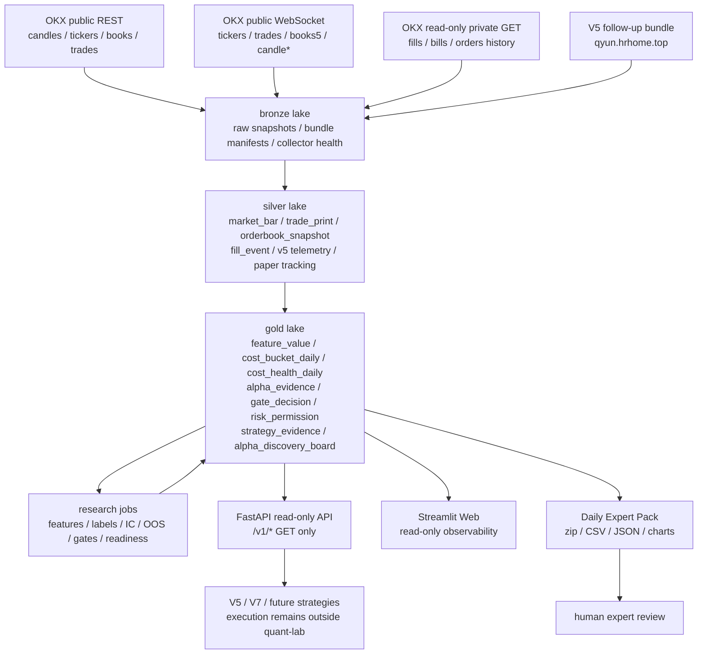
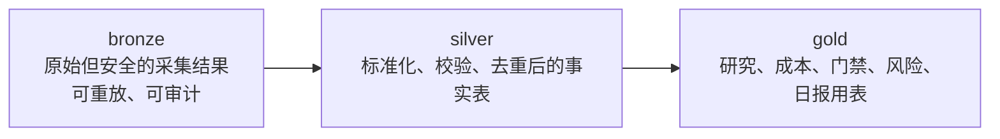
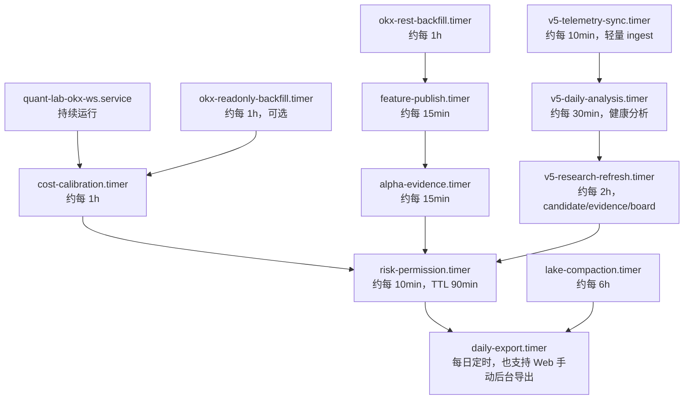
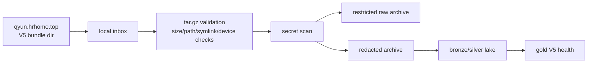
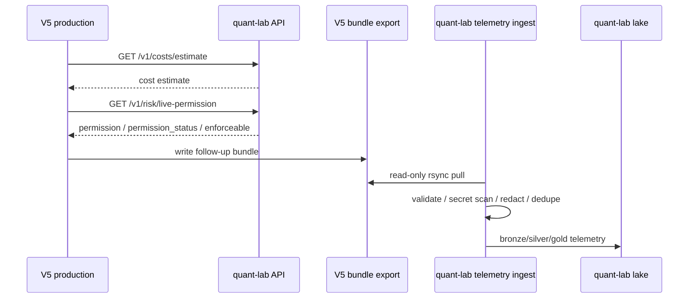
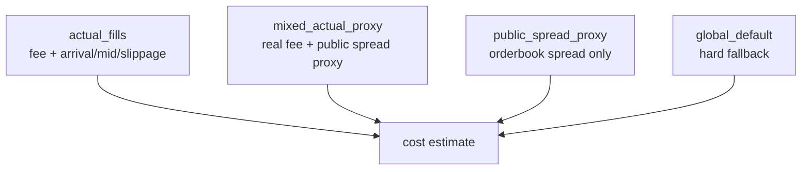
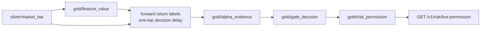

# quant-lab

`quant-lab` 是运行在 `qyun2.hrhome.top` 上的 **OKX-first 只读量化研究中台**。

它不是交易机器人，也不是 V5/V7 的执行替代品。它的职责是把 OKX 行情、可选 OKX read-only private 成交/账单、V5 运行遥测、研究特征、成本模型、alpha evidence、gate decision、risk permission、专家包和 Web 观测台统一成一个可审计、可复盘、可给策略读取的研究中间层。

> 核心原则：`quant-lab` 只读、研究、分析、授权建议；真实下单、撤单、修单、仓位、对账、kill-switch 继续由 V5/V7 负责。

## 目录

- [1. 中台定位](#1-中台定位)
- [2. 总体架构图](#2-总体架构图)
- [3. 中台做什么](#3-中台做什么)
- [4. 中台不做什么](#4-中台不做什么)
- [5. qyun2 生产部署布局](#5-qyun2-生产部署布局)
- [6. 数据湖分层与数据集](#6-数据湖分层与数据集)
- [7. 核心服务工作流](#7-核心服务工作流)
- [8. FastAPI 只读接口](#8-fastapi-只读接口)
- [9. Streamlit Web 观测台](#9-streamlit-web-观测台)
- [10. Daily Expert Pack 专家包](#10-daily-expert-pack-专家包)
- [11. V5 联动和遥测](#11-v5-联动和遥测)
- [12. 成本模型](#12-成本模型)
- [13. Feature / Alpha / Gate / Risk 流程](#13-feature--alpha--gate--risk-流程)
- [14. Enforce Readiness](#14-enforce-readiness)
- [15. 性能、分片和资源控制](#15-性能分片和资源控制)
- [16. 安全边界](#16-安全边界)
- [17. 本地开发与测试](#17-本地开发与测试)
- [18. 常见运维命令](#18-常见运维命令)

## 1. 中台定位

`quant-lab` 的定位是：

```text
OKX-first read-only quantitative research middle platform
```

中文解释：

- **OKX-first**：行情主数据源直接来自 OKX public REST / public WebSocket；真实费用和成交可选来自 OKX read-only private GET。
- **只读**：所有策略消费接口都是 GET；中台不会对交易所或策略状态做任何写操作。
- **研究中台**：中台负责数据、特征、成本、证据、门禁、风险许可、专家包、Web 观测。
- **策略消费者模式**：V5/V7/future strategies 读取中台输出，但不向中台 gold 表写入研究结论。
- **不是交易程序**：V5/V7 仍然负责真实交易执行、仓位、对账、kill-switch、交易所状态管理。

## 2. 总体架构图



## 3. 中台做什么

`quant-lab` 当前覆盖这些工作：

1. **行情采集**
   - OKX public REST 回补 1H market bars。
   - OKX public WebSocket 长期采集 tickers、trades、books5、candle*。
   - 批量 flush 写入 lake，避免每条消息都写盘。
   - 写入 collector health，追踪 last message、reconnect、error、lag。

2. **真实成本数据接入**
   - 可选使用 OKX read-only private GET 拉取 fills、bills、orders history。
   - 私有 key 只能是 Read 权限。
   - 标准化为 `fill_event`、`account_bill`、`order_event`。
   - 不写入 secret、passphrase、auth header。

3. **V5 运行遥测**
   - 通过 SSH/rsync 从 `qyun.hrhome.top` 只读拉取 V5 bundle。
   - 校验 tar.gz 安全性、sha256、路径穿越、symlink、secret scan、脱敏归档。
   - ingest V5 decision audit、quant_lab usage、cost usage、fallback、compliance、candidate snapshot、paper tracking、shadow outcomes。
   - overlapping bundle 使用 event_id/event_key 幂等去重。

4. **数据湖管理**
   - bronze/silver/gold Parquet lake。
   - dataset-level file lock，避免并发写破坏 parquet。
   - lake compaction，减少小文件。
   - lake health / freshness / row count / schema checks。

5. **特征生成**
   - 从 `silver/market_bar` 生成 `gold/feature_value`。
   - 基础特征包括 close return、rolling volatility、volume zscore、range bps、liquidity proxy。
   - 记录 input_hash、input_dataset_version、code_version。
   - 强制 closed bar 和 one-bar decision delay 纪律。

6. **成本模型**
   - 基于 OKX private fills/bills、V5 trades.csv、public orderbook spread 生成 `gold/cost_bucket_daily`。
   - 输出 `gold/cost_health_daily`。
   - 区分 actual_fills、mixed_actual_proxy、public_spread_proxy、global_default。
   - API 支持 symbol normalization 和 regime fallback。

7. **Alpha evidence / gate / risk**
   - 从 feature + market_bar 生成 forward return labels。
   - 计算 IC、rank IC、coverage、edge/cost、OOS statistics。
   - 生成 `gold/alpha_evidence`。
   - 调用 gate engine 输出 `gold/gate_decision`。
   - 结合 gate/cost/data/V5 telemetry 输出 `gold/risk_permission`。

8. **策略证据和 Alpha Discovery Board**
   - 聚合 V5 candidate event/label 和历史 shadow/blocked outcomes。
   - 输出 `gold/strategy_evidence`、`gold/strategy_evidence_sample`。
   - 输出 `gold/alpha_discovery_board`。
   - `alt_impulse_shadow` 现在按 regime 拆分，输出 regime shadow 证据。

9. **只读 API**
   - V5/V7 通过 GET 读取成本估计、gate decision、risk permission。
   - 可选 Bearer token。
   - 不提供 POST/PUT/PATCH/DELETE 策略写接口。

10. **Web 观测台和专家包**
    - Streamlit Web 展示数据质量、成本、V5 telemetry、策略 evidence、专家包下载。
    - Daily Expert Pack 输出 CSV/JSON/图表/manifest/provenance/data_quality。

## 4. 中台不做什么

`quant-lab` 明确禁止：

- 不下单。
- 不撤单。
- 不修单。
- 不转账。
- 不提现。
- 不修改账户配置。
- 不持有 live exchange positions 作为 source of truth。
- 不替代 V5/V7 的 execution、reconcile、kill-switch。
- 不保存或展示 OKX API secret、passphrase、private key、OKX auth header。
- 不把 public spread proxy 伪装成真实 all-in trading cost。
- 不把 alpha evidence 当作 live execution command。
- 不在没有 paper evidence / slippage coverage 时晋级 live。

## 5. qyun2 生产部署布局

生产建议布局：

```text
/opt/quant-lab
  应用代码、虚拟环境、systemd service 使用的 CLI

/etc/quant-lab
  运行配置、API token、OKX read-only env、V5 remote telemetry config
  注意：此目录不进入 Git

/var/lib/quant-lab/lake
  bronze / silver / gold Parquet lake

/var/lib/quant-lab/inbox/v5/bundles
  V5 bundle 拉取 inbox

/var/lib/quant-lab/archive_restricted/v5/bundles
  原始 bundle restricted archive，仅限运维审计，不进 Web 下载

/var/lib/quant-lab/archive/v5/bundles
  脱敏 archive，可给 expert pack 或 Web 引用

/var/lib/quant-lab/exports
  expert pack 输出目录

/var/log/quant-lab
  服务日志，禁止写入 secret
```

## 6. 数据湖分层与数据集

### 6.1 分层原则



### 6.2 bronze

bronze 记录原始采集事实或审计材料，原则是可追溯、可重放、可校验。

常见数据集：

| 数据集 | 说明 |
| --- | --- |
| `bronze/okx_public_ws` | OKX public WS 原始消息 |
| `bronze/collector_health/okx_public_ws` | WS collector 健康状态 |
| `bronze/okx_private_readonly/fills_history` | OKX read-only fills 原始脱敏 payload |
| `bronze/okx_private_readonly/bills` | OKX read-only bills 原始脱敏 payload |
| `bronze/okx_private_readonly/orders_history` | OKX read-only orders history 原始脱敏 payload |
| `bronze/strategy_telemetry/v5/bundle_manifest` | V5 bundle manifest |
| `bronze/strategy_telemetry/v5/secret_scan` | V5 bundle secret scan 结果 |
| `bronze/strategy_telemetry/v5/raw_file_index` | V5 bundle 文件索引 |

### 6.3 silver

silver 是标准化后的事实层，面向研究计算。

| 数据集 | 说明 |
| --- | --- |
| `silver/market_bar` | 统一 OHLCV market bars |
| `silver/trade_print` | public WS/REST trades |
| `silver/orderbook_snapshot` | public WS/REST orderbook snapshot |
| `silver/fill_event` | OKX read-only private 标准化成交 |
| `silver/account_bill` | OKX read-only private 标准化账单 |
| `silver/order_event` | OKX read-only private 标准化订单历史 |
| `silver/v5_decision_audit` | V5 decision audit |
| `silver/v5_trade_event` | V5 交易事件 / trades.csv 标准化 |
| `silver/v5_quant_lab_usage` | V5 调用 quant-lab 使用记录 |
| `silver/v5_quant_lab_request` | V5 quant-lab request 明细 |
| `silver/v5_quant_lab_cost_usage` | V5 成本 API 使用记录 |
| `silver/v5_quant_lab_fallback` | 真实 fallback 事件，已 event_key 去重 |
| `silver/v5_quant_lab_compliance` | V5 permission/cost compliance |
| `silver/v5_candidate_event` | V5 candidate snapshot / candidate event |
| `silver/v5_candidate_label` | V5 candidate 后验标签 |
| `silver/v5_shadow_outcome` | V5 historical shadow/blocked outcomes |
| `silver/v5_paper_strategy_run` | V5 paper strategy run/heartbeat |
| `silver/v5_paper_strategy_daily` | V5 paper daily summary |
| `silver/v5_paper_slippage_coverage` | V5 paper slippage coverage |

### 6.4 gold

gold 是研究、门禁、API、Web、专家包的主要读取层。

| 数据集 | 说明 |
| --- | --- |
| `gold/feature_value` | 版本化特征值 |
| `gold/feature_coverage_daily` | 特征覆盖率 |
| `gold/feature_anomaly_daily` | 特征异常 |
| `gold/cost_bucket_daily` | 按 symbol/regime/notional bucket 的成本桶 |
| `gold/cost_health_daily` | 成本模型健康状态 |
| `gold/alpha_evidence` | alpha 统计证据 |
| `gold/gate_decision` | alpha gate 决策 |
| `gold/risk_permission` | V5/V7 读取的风险许可 |
| `gold/strategy_health_daily` | V5 telemetry 健康摘要 |
| `gold/v5_execution_quality_daily` | V5 执行质量 |
| `gold/v5_gate_compliance_daily` | V5 是否遵守 quant-lab gate |
| `gold/v5_missed_opportunity_daily` | 错失机会统计 |
| `gold/v5_config_health_daily` | V5 配置消费健康 |
| `gold/v5_issue_summary_daily` | V5 issue 汇总 |
| `gold/v5_quant_lab_mode_daily` | V5 quant-lab mode / enforcement mode |
| `gold/v5_quant_lab_enforcement_daily` | V5 enforce compliance 统计 |
| `gold/strategy_evidence` | 策略候选聚合证据 |
| `gold/strategy_evidence_sample` | 策略候选样本明细 |
| `gold/strategy_evidence_quality` | strategy evidence 质量告警 |
| `gold/alpha_discovery_board` | Alpha Discovery Board |

## 7. 核心服务工作流

生产服务由 systemd 管理。当前设计避免把所有重计算塞进一次 `sync-v5-telemetry`，而是拆成轻量同步、分析、研究刷新、导出、压缩等独立服务。



### 7.1 OKX WebSocket collector

服务：`quant-lab-okx-ws.service`

作用：

- 订阅 `BTC-USDT,ETH-USDT,SOL-USDT,BNB-USDT`。
- public channels：`tickers,trades,books5`。
- 批量 flush 写入，降低 I/O 压力。
- 写入：
  - `bronze/okx_public_ws`
  - `silver/trade_print`
  - `silver/orderbook_snapshot`
  - `silver/market_bar`
  - `bronze/collector_health/okx_public_ws`

关键约束：

- 只连 OKX public WebSocket。
- 不发送 login。
- 不订阅 private/trading channel。

### 7.2 OKX REST backfill

服务：`quant-lab-okx-rest-backfill.timer`

作用：

- 定期回补 1H candles。
- 生成或补充 `silver/market_bar`。
- REST 适合 backfill，WS 适合实时。

### 7.3 OKX read-only private backfill

服务：`quant-lab-okx-readonly-backfill.timer`

作用：

- 可选读取 OKX read-only private GET：
  - fills history
  - bills
  - orders history
- 生成真实成本模型输入。

关键约束：

- 只允许 GET。
- key 必须只有 Read 权限。
- 禁止 Trade / Withdraw 权限。
- 不写 secret 到 lake、日志、archive、expert pack。

### 7.4 V5 telemetry sync

服务：`quant-lab-v5-telemetry-sync.timer`

作用：

- 从 `qyun.hrhome.top` 只读拉取 V5 bundle。
- 每次默认只处理少量最新 bundle，避免重复扫描历史导致资源暴涨。
- 安全校验、secret scan、redaction、manifest、provenance。
- 解析并写入 V5 silver/gold telemetry。

处理逻辑：



### 7.5 V5 daily analysis

服务：`quant-lab-v5-daily-analysis.timer`

作用：

- 生成 `strategy_health_daily`、`v5_execution_quality_daily`、`v5_gate_compliance_daily` 等。
- 这是轻量健康分析，不负责重跑所有历史策略研究。

### 7.6 V5 research refresh

服务：`quant-lab-v5-research-refresh.timer`

作用：

- 增量构建 candidate labels。
- 增量构建 strategy evidence。
- 构建 alpha discovery board。

当前思路：

- 不反复带着所有历史数据重算。
- 使用 lookback / incremental 模式。
- 历史 shadow/blocked outcomes 进入 strategy evidence，但会避免重复膨胀。

### 7.7 Cost calibration

服务：`quant-lab-cost-calibration.timer`

作用：

- 聚合 OKX private fills/bills、V5 trades、public orderbook spread。
- 生成 `cost_bucket_daily` 和 `cost_health_daily`。

成本优先级：

1. `actual_fills`
2. `mixed_actual_proxy`
3. `public_spread_proxy`
4. `global_default`

### 7.8 Feature publish

服务：`quant-lab-feature-publish.timer`

作用：

- 从 `silver/market_bar` 生成 `gold/feature_value`。
- 同时生成 coverage / anomaly。
- 特征只使用当前和历史 closed bars。

### 7.9 Alpha evidence

服务：`quant-lab-alpha-evidence.timer`

作用：

- 使用 feature_value 和 market_bar 构建 forward return labels。
- one-bar decision delay。
- 输出 alpha evidence。
- 不生成交易指令。

### 7.10 Risk permission

服务：`quant-lab-risk-permission.timer`

作用：

- 每 10 分钟左右刷新 risk_permission。
- TTL 生产建议 90 分钟。
- API 如果发现 gold permission 过期，不会把过期记录伪装成 ACTIVE。

### 7.11 Daily export

服务：`quant-lab-daily-export.timer`

作用：

- 读取已有 lake 结果并打包。
- 生产策略是：重计算放在日常 timer 中，export 尽量只做轻量快照和打包。
- Web 手动生成包也应走后台 subprocess，避免阻塞 Streamlit 主进程。

### 7.12 Lake compaction

服务：`quant-lab-lake-compaction.timer`

作用：

- 压缩高频写入的小 parquet 文件。
- 降低读取时扫描文件数量。
- 降低 Web / export / API 卡顿概率。

## 8. FastAPI 只读接口

服务：`quant-lab-api.service`

默认地址：

```text
http://qyun2.hrhome.top:8027
```

所有 strategy-facing 接口使用 GET。

主要接口：

| Endpoint | 作用 |
| --- | --- |
| `GET /v1/health` | 服务健康 |
| `GET /v1/catalog/datasets` | 已知数据集 |
| `GET /v1/ops/api-metrics` | API 请求统计 |
| `GET /v1/market/bars` | market bars |
| `GET /v1/features/latest` | 最新特征 |
| `GET /v1/costs/estimate` | 成本估计 |
| `GET /v1/research/alpha/{alpha_id}` | alpha evidence |
| `GET /v1/gates/decision/{alpha_id}` | gate decision |
| `GET /v1/risk/live-permission` | 风险许可基础合约 |
| `GET /v1/risk/live-permission-detail` | 风险许可详细诊断 |

API 认证：

- 如果配置 `QUANT_LAB_API_TOKEN`，`/v1/*` 必须携带 `Authorization: Bearer <token>`。
- token 比较使用 constant-time compare。
- 可关闭 docs：`QUANT_LAB_DISABLE_DOCS=true`。
- 可配置允许客户端 IP：`QUANT_LAB_ALLOWED_CLIENT_IPS`。

成本 API 关键行为：

- 统一 symbol normalization：
  - `BNB/USDT` -> `BNB-USDT`
  - `BNB-USDT` -> `BNB-USDT`
  - `BNBUSDT` -> `BNB-USDT`
  - `OKX:BNB-USDT` -> `BNB-USDT`
- 请求 regime 不匹配时，优先 fallback 到同 symbol 的 public proxy，而不是直接 global default。
- `global_default` 只在 symbol 缺失、数据 stale、服务不可用、schema 不可读时使用，并标记 degraded。

Risk API 关键行为：

- 优先返回 strategy/version 匹配且未过期的最新 ACTIVE permission。
- 过期 permission 不会被包装成 ACTIVE。
- 没有 fresh permission 时返回 `NO_FRESH_PERMISSION` 或 STALE/EXPIRED 状态，`enforceable=false`。

## 9. Streamlit Web 观测台

服务：`quant-lab-web.service`

默认地址：

```text
http://qyun2.hrhome.top:8501
```

Web 只读读取 lake/API，不做交易动作。

主要页面：

1. **Overview**
   - 总体状态。
   - 数据 freshness。
   - latest V5 bundle。
   - risk permission。
   - cost fallback。
   - alpha gate counts。
   - expert pack 状态和下载。

2. **Data Health**
   - dataset exists/rows/path。
   - stale/missing/unknown。
   - parquet 文件数量。
   - 建议修复命令。

3. **OKX Collectors**
   - REST / WS 状态。
   - collector health。
   - last_message_at。
   - reconnect/error count。

4. **Market Regime**
   - spread bps。
   - trade activity。
   - depth。
   - abnormal symbols。

5. **Cost Model**
   - cost_bucket_daily。
   - cost_health_daily。
   - actual/mixed/proxy/global_default 覆盖。
   - API hit quality。

6. **Alpha Gates / Research**
   - alpha evidence。
   - gate decisions。
   - strategy evidence。
   - alpha discovery board。
   - alt impulse regime shadow。

7. **Strategy Consumers**
   - V5/V7 读取状态。
   - risk permission。
   - fallback / compliance。

8. **Expert Exports**
   - 生成今日包。
   - 后台导出状态。
   - zip 文件列表和下载。

Web 生成专家包的设计原则：

- 不在 Streamlit 主线程里做重计算。
- 默认后台 subprocess。
- export 尽量只打包已有结果。
- 重计算由 timer 日常完成。
- 保留最近有限数量包，避免 exports 目录无限膨胀。

## 10. Daily Expert Pack 专家包

专家包是给人工专家复盘、排查、决策使用的 zip。

典型内容：

```text
README.md
manifest.json
provenance.json
data_quality.json
executive_summary.md
expert_questions.md

market/
features/
costs/
research/
risk/
v5/
reports/
charts/
anomalies/
```

重要输出：

| 文件 | 说明 |
| --- | --- |
| `manifest.json` | 包内文件、row count、freshness、git provenance |
| `data_quality.json` | 缺失、过期、异常、FAIL/WARN/OK |
| `executive_summary.md` | 面向人读的摘要 |
| `expert_questions.md` | 动态生成待专家判断的问题 |
| `research/strategy_evidence.csv` | 策略候选聚合证据 |
| `research/strategy_evidence_samples.csv` | 样本级证据 |
| `research/alpha_discovery_board.csv` | Alpha Discovery Board |
| `research/alt_impulse_shadow_by_regime.csv` | alt impulse 按 regime 聚合 |
| `research/alt_impulse_shadow_by_symbol_regime_horizon.csv` | alt impulse 按 symbol/regime/horizon 明细 |
| `reports/paper_strategy_proposals.csv` | paper 策略建议 |
| `reports/paper_strategy_runs.csv` | V5 paper run/heartbeat |
| `reports/paper_strategy_daily.csv` | V5 paper daily |
| `reports/paper_slippage_coverage.csv` | paper slippage coverage |
| `reports/final_score_vs_alpha6_conflict.csv` | Alpha6 强买入但 final_score/no_order 压制的只读审计 |
| `reports/v5_enforce_readiness.json` | enforce readiness |

专家包不是交易指令。它是证据包。

## 11. V5 联动和遥测

V5 是交易程序，`quant-lab` 是研究中台。两者通过只读接口和 bundle 遥测联动。



V5 bundle 进入中台后用于：

- 运行健康。
- fallback/timeout 统计。
- quant-lab API 使用情况。
- permission compliance。
- cost usage。
- candidate snapshot。
- strategy evidence。
- paper strategy tracking。

关键幂等规则：

- 不以 bundle_name 作为事件唯一键。
- 优先使用交易端 event_id。
- 否则用 strategy/run_id/event_type/endpoint/ts/error/request_id/symbol/side/raw_hash 组合 event_key。
- overlapping bundle 中重复事件只计一次。

## 12. 成本模型

成本模型输出：

- `gold/cost_bucket_daily`
- `gold/cost_health_daily`

成本来源优先级：



解释：

- `actual_fills`：有真实成交、费用、可计算真实或近似 slippage。
- `mixed_actual_proxy`：有真实 fee，但 slippage 只能用盘口 spread proxy。
- `public_spread_proxy`：只有 public orderbook spread，没有真实 fill。
- `global_default`：缺 symbol 或服务不可用时保守默认值。

健康口径：

- `hard_fallback_ratio`：global default / symbol missing / service unavailable / stale bucket。
- `soft_fallback_ratio`：sample too small / slippage unknown / spread proxy。
- `proxy_only_count`：只有 public spread proxy。
- `global_default_count`：硬默认成本。

这避免把 mixed_actual_proxy 和 public_spread_proxy 全部误读成“完全不可用”。

## 13. Feature / Alpha / Gate / Risk 流程



### 13.1 Feature

基础特征：

- `close_return_1`
- `close_return_4`
- `close_return_24`
- `rolling_volatility_24`
- `rolling_volatility_72`
- `volume_zscore_24`
- `range_bps`
- `close_position_in_range`
- `dollar_volume`
- `liquidity_proxy`

约束：

- 按 symbol/timeframe 分组。
- 不跨 symbol 混算。
- 不使用未来数据。
- timestamp UTC。
- one-bar delay 用于研究和 decision。

### 13.2 Alpha evidence

`alpha_evidence` 包含：

- coverage
- IC / rank IC
- t-stat
- OOS Sharpe / drawdown
- edge_cost_ratio
- profitable_folds_ratio
- train_oos_decay
- paper_days
- paper_slippage_coverage
- evidence_status

样本不足时不能通过伪造负 IC 表达，必须用 `evidence_status=insufficient_samples` 等状态。

### 13.3 Gate

gate statuses：

- `DEAD`
- `QUARANTINE`
- `PAPER_READY`
- `LIVE_READY`

当前原则：

- 弱 alpha 快速死亡。
- 样本不足保持保守。
- 没有 paper days / slippage coverage 不能 live。
- bootstrap placeholder 不能 live。

### 13.4 Risk permission

risk permissions：

- `ALLOW`
- `SELL_ONLY`
- `ABORT`

扩展状态：

- `ACTIVE_ALLOW`
- `ACTIVE_SELL_ONLY`
- `ACTIVE_ABORT`
- `STALE_*`
- `EXPIRED_*`
- `NO_FRESH_PERMISSION`

Risk API 会输出 `enforceable`，只有未过期 ACTIVE 状态才可 enforce。

## 14. Enforce Readiness

`quant-lab` 会输出 V5 是否适合从 shadow 切到 enforce。

readiness 检查：

- risk_permission fresh。
- risk_permission API 与 gold 最新一致。
- cost API global_default rate 不高。
- cost symbol hit rate 足够。
- actual/mixed cost coverage 足够。
- telemetry dedupe health 正常。
- fallback rate 不高。
- alpha gate 不为 DEAD。
- V5 decision audit 存在。

输出：

- `readiness_status = BLOCKED / WARN / READY`
- `blocked_reasons`
- `warning_reasons`
- `required_actions`
- `shadow_only_recommended`

如果不是 READY，不建议 V5 切 enforce。

## 15. 性能、分片和资源控制

当前中台的性能治理原则：

1. **不要在 Web 点击时重算全世界**
   - Web 的“生成今日包”应尽量只打包已有结果。
   - 重计算由 timer 日常执行。

2. **V5 telemetry sync 轻量化**
   - 每 10 分钟拉取/ingest 最新少量 bundle。
   - 历史 shadow outcomes 不在每次轻量 sync 重算。
   - 重型 research refresh 单独跑。

3. **增量研究**
   - candidate labels / strategy evidence 使用 incremental + lookback。
   - 避免每 2 小时把所有历史数据全量重算。

4. **lake compaction**
   - 高频写入会产生很多小 parquet。
   - compaction 定期合并，降低 Web/API/export 扫描成本。

5. **资源限制**
   - systemd 设置 `MemoryMax`。
   - Polars 限制线程。
   - heavy jobs 使用 `flock`，避免多个重任务并发。

6. **数据集锁**
   - Parquet 写入使用 dataset-level lock。
   - 降低并发写破坏 parquet 的风险。

## 16. 安全边界

### 16.1 交易边界

`quant-lab` 禁止实现：

- order placement
- order cancellation
- order amendment
- funds transfer
- withdrawal
- account mutation
- live order mutation
- private trading websocket
- private trading REST mutation

### 16.2 Secret 边界

禁止写入 Git、lake、log、expert pack、Web：

- OKX API key
- OKX secret key
- OKX passphrase
- private key
- OKX auth header
- SSH private key 内容
- QUANT_LAB_API_TOKEN

V5 bundle ingest 有 secret scan/redaction：

- 原始 bundle 只进入 restricted archive。
- redacted archive 可用于普通审计。
- expert pack 不能包含未脱敏 config/log。

### 16.3 API 边界

- strategy-facing API 只允许 GET。
- 不增加 POST/PUT/PATCH/DELETE 策略接口。
- API 返回的是研究/许可/风险信息，不是交易指令。

## 17. 本地开发与测试

安装：

```bash
python -m pip install -e '.[dev]'
```

测试：

```bash
python -m pytest -q
python -m ruff check .
```

常用本地命令：

```bash
qlab gate-example
qlab okx-fetch-candles --inst-id BTC-USDT --bar 1H --market-type SPOT --lake-root /tmp/quant-lab-demo-lake
qlab publish-features --lake-root /tmp/quant-lab-demo-lake --feature-set core --feature-version v0.1 --timeframe 1H --symbols BTC-USDT,ETH-USDT,SOL-USDT,BNB-USDT
qlab calibrate-costs --lake-root /tmp/quant-lab-demo-lake --day 2026-05-19
qlab export-daily --date 2026-05-19 --lake-root /tmp/quant-lab-demo-lake --out-dir /tmp/quant-lab-exports
```

启动 API：

```bash
uvicorn quant_lab.api.main:app --host 127.0.0.1 --port 8027
```

启动 Web：

```bash
qlab-web --host 127.0.0.1 --port 8501 --lake-root /tmp/quant-lab-demo-lake
```

## 18. 常见运维命令

生产服务状态：

```bash
systemctl status quant-lab-api.service
systemctl status quant-lab-web.service
systemctl status quant-lab-okx-ws.service
systemctl status quant-lab-v5-telemetry-sync.timer
systemctl status quant-lab-risk-permission.timer
```

查看 timer：

```bash
systemctl list-timers 'quant-lab-*'
```

手动同步 V5 telemetry：

```bash
qlab sync-v5-telemetry --config /etc/quant-lab/v5_telemetry_remote.yaml --max-bundles 1 --newest-first --skip-historical-outcomes
```

手动跑 V5 health：

```bash
qlab analyze-v5-telemetry --lake-root /var/lib/quant-lab/lake --skip-candidate-gold
```

手动刷新 V5 research：

```bash
qlab build-v5-candidate-labels --lake-root /var/lib/quant-lab/lake --date auto --mode incremental --lookback-days 8
qlab build-strategy-evidence --lake-root /var/lib/quant-lab/lake --date auto --mode incremental --lookback-days 8 --skip-historical-outcomes
qlab build-alpha-discovery-board --lake-root /var/lib/quant-lab/lake --date auto --skip-legacy-outcome-counts
```

手动刷新 risk permission：

```bash
qlab publish-risk-permission --lake-root /var/lib/quant-lab/lake --strategy v5 --version 5.0.0
```

手动生成专家包：

```bash
qlab export-daily --date "$(date +%F)" --lake-root /var/lib/quant-lab/lake --out-dir /var/lib/quant-lab/exports --no-refresh-risk-permission --no-pre-export-v5-refresh
```

检查 lake：

```bash
qlab lake-health --lake-root /var/lib/quant-lab/lake
```

压缩热点数据集：

```bash
qlab compact-lake-dataset --lake-root /var/lib/quant-lab/lake --dataset silver/v5_quant_lab_usage --target-rows-per-file 250000 --max-source-files-per-batch 500
```

## 当前重点观察项

1. **V5 telemetry freshness**
   - latest bundle 时间是否接近当前时间。
   - candidate_event 是否跟上最新 V5 candidate_snapshot。

2. **risk_permission freshness**
   - 是否 ACTIVE。
   - expires_in_sec 是否足够。
   - API 返回是否和 gold 最新一致。

3. **cost health**
   - global_default 是否为 0 或接近 0。
   - symbol hit rate 是否高。
   - actual/mixed cost coverage 是否提升。

4. **alt impulse regime shadow**
   - 看 `alt_impulse_shadow_by_regime.csv`。
   - 看 `alt_impulse_shadow_by_symbol_regime_horizon.csv`。
   - 判断 alt impulse 到底在哪些 regime 下有效。
   - 不允许直接 live。

5. **SOL paper strategies**
   - proposals 是否存在。
   - V5 paper run heartbeat 是否 active。
   - entry_day_count / paper_pnl_day_count 是否真的产生。
   - slippage coverage 是否够。

## 关联文档

- [Architecture](docs/ARCHITECTURE.md)
- [API Contract](docs/API_CONTRACT.md)
- [Cost Model](docs/COST_MODEL.md)
- [Features](docs/FEATURES.md)
- [Alpha Evidence](docs/ALPHA_EVIDENCE.md)
- [OKX Read-only Private](docs/OKX_READONLY_PRIVATE.md)
- [V5 Integration](docs/V5_INTEGRATION.md)
- [V5 Remote Telemetry Collection](docs/V5_REMOTE_TELEMETRY_COLLECTION.md)
- [Web Dashboard](docs/WEB_DASHBOARD.md)
- [Production Schedule](docs/PRODUCTION_SCHEDULE.md)
- [Lake Optimization](docs/LAKE_OPTIMIZATION.md)
