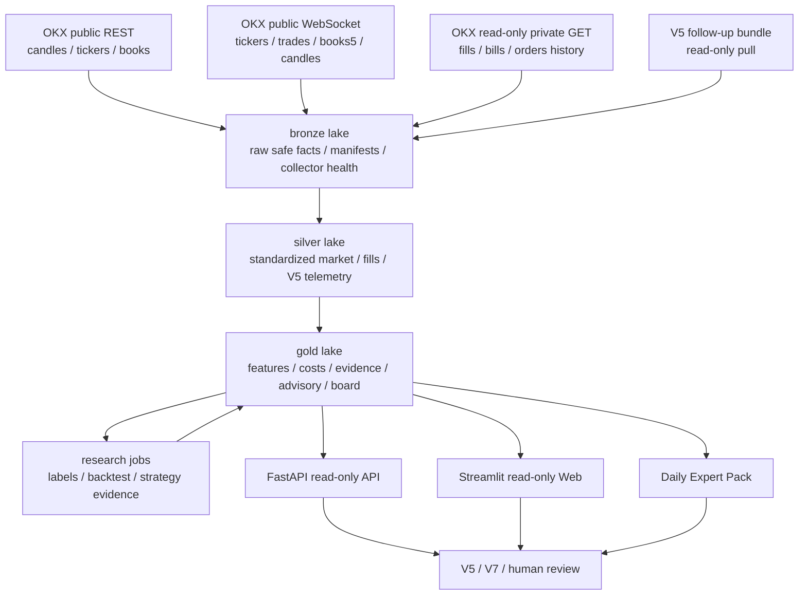
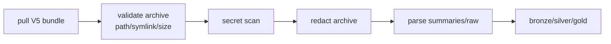

# quant-lab 量化研究中台

quant-lab 是 OKX-first 的只读量化研究中台。它服务于 V5/V7 等交易系统，但不替代交易系统，不下单、不撤单、不改仓位、不写交易所状态。

它的职责是把 OKX 行情、只读成交/账单、V5 follow-up bundle、成本模型、策略 evidence、paper/shadow 结果、backtest、advisory、专家包和 Web 观测台整合成一个可审计、可复盘、可被交易端读取的研究层。

核心边界：

```text
quant-lab = read-only research / advisory / audit / export
V5/V7     = live execution / positions / reconcile / kill-switch
```

## 当前系统定位

quant-lab 当前解决四类问题：

1. **真实成本是否可信**
   - 区分 actual_fills、mixed_actual_proxy、public_spread_proxy、global_default。
   - 输出 all-in one-way / roundtrip 成本。
   - 给 V5 提供成本估计和 cost trust 字段。

2. **策略证据是否足够**
   - 聚合 V5 candidate snapshot、paper runs、shadow labels、blocked outcomes。
   - 输出 strategy evidence、alpha discovery board、paper proposals。
   - 支持 final_score vs Alpha6 conflict、BNB strong Alpha6 bypass、risk-on multi-buy、expanded universe 等研究。

3. **是否适合从 shadow/paper 升级**
   - 输出 strategy opportunity advisory。
   - 支持 PAPER_READY / KEEP_SHADOW / KILL / REGIME_SHADOW / LIVE_SMALL_REVIEW_ONLY 等只读状态。
   - 不直接指挥 V5 live order。

4. **专家能否离线复盘**
   - Daily Expert Pack 输出 CSV/JSON/Markdown。
   - Web 页面提供只读下载、数据质量和运行状态。
   - manifest/provenance/data_quality 标明数据是否 fresh、是否 dirty、是否缺表。

## 不做什么

quant-lab 禁止：

- 下单；
- 撤单；
- 修单；
- 转账；
- 提现；
- 改账户配置；
- 写交易端 live state；
- 把 paper/shadow 直接升级成 live order；
- 把 stale advisory 当 fresh；
- 把 public spread proxy 伪装成真实 actual cost；
- 在专家包、日志、lake、Web 中输出 secret。

所有 strategy-facing API 都是 GET/read-only。

## 架构



## 生产目录

推荐生产布局：

```text
/opt/quant-lab
  application code and virtualenv

/etc/quant-lab
  runtime config, API token, read-only OKX env, V5 sync config
  not committed to Git

/var/lib/quant-lab/lake
  bronze / silver / gold parquet lake

/var/lib/quant-lab/inbox/v5/bundles
  V5 bundle inbox

/var/lib/quant-lab/archive_restricted/v5/bundles
  original restricted V5 archives

/var/lib/quant-lab/archive/v5/bundles
  redacted V5 archives

/var/lib/quant-lab/exports
  daily expert packs
```

不要把 `/etc/quant-lab` 或 runtime lake 文件提交到 Git。

## 数据湖

### Bronze

原始但安全的采集事实：

```text
bronze/okx_public_ws
bronze/collector_health/okx_public_ws
bronze/okx_private_readonly/fills_history
bronze/okx_private_readonly/bills
bronze/strategy_telemetry/v5/bundle_manifest
bronze/strategy_telemetry/v5/secret_scan
bronze/lake_file_index
```

### Silver

标准化事实层：

```text
silver/market_bar
silver/trade_print
silver/orderbook_snapshot
silver/orderbook_spread_1m
silver/trade_activity_1m
silver/fill_event
silver/account_bill
silver/order_event
silver/v5_decision_audit
silver/v5_trade_event
silver/v5_candidate_event
silver/v5_candidate_label
silver/v5_paper_strategy_run
silver/v5_paper_strategy_daily
silver/v5_bnb_paper_strategy_runs
silver/v5_bnb_paper_strategy_daily
silver/v5_quant_lab_usage
silver/v5_quant_lab_request
```

### Gold

研究和 API 读取层：

```text
gold/feature_value
gold/factor_definition
gold/factor_value
gold/factor_evidence
gold/factor_candidate
gold/factor_correlation_daily
gold/cost_bucket_daily
gold/cost_health_daily
gold/alpha_evidence
gold/gate_decision
gold/risk_permission
gold/strategy_evidence
gold/strategy_evidence_sample
gold/alpha_discovery_board
gold/market_regime_daily
gold/regime_strategy_advisory
gold/v5_final_score_vs_alpha6_conflict
gold/v5_bnb_strong_alpha6_bypass_shadow
gold/v5_negative_expectancy_attribution
gold/v5_bnb_paper_strategy_daily_latest
```

## 因子工厂

Factor Factory 是 quant-lab 的只读自动因子发现与测试模块。它从
`gold/feature_value` 读取已发布特征，生成版本化因子，使用至少 1 根
closed bar 的 decision delay 构造 forward label，再输出 IC、Rank IC、
after-cost quantile spread、候选状态和相关性诊断。

输出数据：

```text
gold/factor_definition
gold/factor_value
gold/factor_evidence
gold/factor_candidate
gold/factor_correlation_daily
```

CLI：

```bash
qlab build-factor-factory \
  --lake-root /var/lib/quant-lab/lake \
  --date auto \
  --horizon-bars 4,8,24,72 \
  --decision-delay-bars 1 \
  --apply

qlab factor-factory-health \
  --lake-root /var/lib/quant-lab/lake
```

`PAPER_READY` 只表示进入人工 paper review 队列，不代表 live eligibility。
Factor Factory 不下单、不撤单、不修改 V5/V7 live 逻辑。详见
[`docs/FACTOR_FACTORY.md`](docs/FACTOR_FACTORY.md)。

## API

服务：

```text
quant-lab-api.service
```

典型端口：

```text
8027
```

主要接口：

| Endpoint | 用途 |
| --- | --- |
| `GET /v1/health` | 轻量健康检查，不扫 lake |
| `GET /v1/health/deep` | 深度 freshness/dataset 检查 |
| `GET /v1/costs/estimate` | 成本估计 |
| `GET /v1/risk/live-permission` | 风险许可基础输出 |
| `GET /v1/risk/live-permission-detail` | 风险许可详细诊断 |
| `GET /v1/strategy-opportunity-advisory` | 策略机会 advisory |
| `GET /v1/strategy_opportunity_advisory` | 下划线兼容接口 |
| `GET /v1/strategy-opportunity-advisory/v5-compact` | V5 compact advisory |
| `GET /v1/ops/api-metrics` | API latency/cache metrics |

### StrategyOpportunityAdvisoryCache

advisory API 不应在请求路径扫描 lake。服务启动时加载快照到内存，文件 mtime/source sha 变化时才 reload。

支持参数：

```text
symbols
families
latest_only
fresh_only
fields=minimal
```

V5 优先使用 compact endpoint 或缓存结果，超时走本地 fallback，不阻塞主循环。

API metrics 记录：

```text
endpoint
method
status_code
latency_ms
cache_hit
rows_returned
response_bytes
lake_scan_ms
serialize_ms
error_type
```

专家包导出：

```text
reports/api_latency_summary.csv
reports/api_latency_summary.md
```

## 成本模型

成本来源优先级：

```text
actual_fills
mixed_actual_proxy
public_spread_proxy
global_default
```

输出字段包括：

```text
one_way_all_in_cost_bps
roundtrip_all_in_cost_bps
cost_quality
cost_trusted_for_paper
cost_trusted_for_live
cost_trust_level
allowed_live_modes
```

使用原则：

- actual fills 最可信；
- mixed actual proxy 可以用于 paper/shadow 和部分 live 评估；
- public spread proxy 不能直接证明 live ready；
- global default 必须标记 degraded；
- symbol-level fallback 优先于 global default。

## V5 telemetry ingest

quant-lab 只读拉取 V5 follow-up bundle。

处理流程：



已 ingest 的 V5 输出包括：

```text
candidate_snapshot.csv
quant_lab_cost_usage.csv
strategy_opportunity_advisory_reader.csv
paper_strategy_runs.csv
paper_strategy_daily.csv
bnb_paper_strategy_runs.csv
bnb_paper_strategy_daily.csv
negative_expectancy_attribution.csv
final_score_vs_alpha6_conflict.csv
bnb_strong_alpha6_bypass_shadow.csv
risk_on_multi_buy_shadow.csv
order_lifecycle.csv
trades_roundtrips.csv
```

重复 bundle 使用 event_id/event_key 幂等去重，不用 bundle name 当事件唯一键。

## Strategy Opportunity Advisory

advisory 是给 V5 或人工阅读的只读建议，不是 live command。

常见字段：

```text
strategy_candidate
symbol
decision
recommended_mode
horizon_hours
source_module
promotion_state
max_paper_notional_usdt
max_live_notional_usdt
live_block_reasons
generated_at
expires_at
contract_version
```

V5 侧默认只响应：

```text
recommended_mode=paper
recommended_mode=shadow
decision=KILL
```

默认忽略 `max_live_notional_usdt`。只有 V5 本地显式打开 `enable_live_small_from_quant_lab=true`，并且 advisory fresh、decision 合法、V5 本地 live gate 也通过时，未来才可能进入 live-small 评估。

advisory 去重 logical key：

```text
strategy_candidate
symbol
horizon_hours
source_module
candidate_id
```

Alpha Factory / second-stage candidates 的最终状态必须受 promotion queue 封顶。regime router 不得把 KEEP_SHADOW 的 Alpha Factory 候选升成 PAPER_READY。

## Paper / Shadow / Research

当前支持的研究方向：

- SOL paper strategies；
- ETH f3 dominant paper；
- BNB f3/risk-on paper；
- BNB strong Alpha6 bypass shadow；
- final_score vs Alpha6 conflict；
- risk-on multi-buy shadow；
- expanded universe HYPE/WLD paper；
- Alpha Factory second-stage shadow；
- entry quality advisory；
- missed-low / late-entry chase / pullback reversal；
- bottom-zone reversal shadow。

所有输出都必须保留 read-only 标记。

## Backtest

quant-lab 已包含只读 backtest/reporting 框架。它使用已有 future labels 和 market bars 做研究复盘，不重放真实 live execution。

主要输出：

```text
reports/backtest_label_summary.csv
reports/backtest_label_summary.md
reports/backtest_regime_breakdown.csv
reports/v5_decision_replay_trades.csv
reports/v5_decision_replay_equity.csv
reports/v5_decision_replay_summary.md
reports/bottom_zone_backtest.csv
reports/bottom_zone_backtest_summary.md
reports/research_promotion_decision.csv
reports/research_promotion_decision.md
```

第一批稳定 strategy id：

```text
BNB_STRONG_ALPHA6_BYPASS_BACKTEST
FINAL_SCORE_ALPHA6_CONFLICT_BACKTEST
HYPE_EXPANDED_UNIVERSE_BACKTEST
WLD_EXPANDED_UNIVERSE_BACKTEST
RISK_ON_MULTI_BUY_BACKTEST
BOTTOM_ZONE_PROBE_BACKTEST
```

`backtest_regime_breakdown.csv` 按 strategy/symbol/regime/horizon 输出：

```text
sample_count
complete_sample_count
avg_net_bps
p25_net_bps
win_rate
recommendation
live_order_effect=read_only_no_live_order
```

Backtest 结果只用于研究晋级讨论，不自动改变 V5 live。

## Bottom Zone / Fast Microstructure / Market Pressure

bottom-zone 用于研究“低位反转/卖压衰竭/回踩修复”场景。

输出：

```text
reports/bottom_zone_reversal_shadow.csv
reports/bottom_zone_reversal_summary.md
reports/fast_microstructure_features.csv
reports/market_pressure_score.csv
reports/market_pressure_summary.md
```

bottom-zone 必要字段：

```text
support_zone_low
support_zone_high
distance_to_support_bps
orderbook_imbalance_1m
taker_buy_sell_imbalance_5m
cvd_5m
vwap_reclaim_15m
volatility_climax_score
bottom_zone_score
bounce_probability_4h
invalid_below_px
no_trigger_reasons
```

如果没有 paper trigger，也要输出 no-trigger reason，不能只给空表让下游猜。

## Alpha Factory

Alpha Factory 候选示例：

```text
v5.expanded_relative_strength_top1_shadow
v5.expanded_relative_strength_top3_shadow
v5.futures_risk_off_hedge_proxy_shadow
v5.futures_downtrend_short_proxy_shadow
v5.btc_strict_probe_exit_policy_review
v5.pair_trade_eth_btc_shadow
```

当前阶段：

- 可以 research/display；
- 可以 shadow；
- 满足条件时可以 paper；
- 不允许直接 live；
- dashboard 的 PAPER_READY 计数必须以 alpha_factory_promotion_queue 为准。

## Expert Pack

专家包是人工复盘用 zip，不是交易命令。

生成命令：

```bash
qlab export-daily \
  --date "$(date +%F)" \
  --lake-root /var/lib/quant-lab/lake \
  --out-dir /var/lib/quant-lab/exports
```

包内关键文件：

```text
README.md
manifest.json
provenance.json
data_quality.json
executive_summary.md
expert_questions.md
reports/strategy_opportunity_advisory.csv
reports/backtest_label_summary.csv
reports/backtest_regime_breakdown.csv
reports/bottom_zone_reversal_shadow.csv
reports/final_score_vs_alpha6_conflict.csv
reports/bnb_strong_alpha6_bypass_shadow.csv
reports/bnb_paper_strategy_daily.csv
reports/api_latency_summary.csv
```

Web 手动导出应走后台 subprocess，并写 completion status。导出过程不应因为旧全量扫描或小文件问题阻塞 Web 主线程。

## Web 观测台

服务：

```text
quant-lab-web.service
```

页面只读，不提供交易操作。

Web reader 性能要求：

- 优先使用 `bronze/lake_file_index`。
- 有 `_snapshot_meta.json` 时优先读取 metadata。
- lake 内数据集缺少 file index 时不再 fallback rglob；页面必须显式提示刷新索引：

```text
web_file_index_missing_refresh_required
```

数据集 freshness 页面应说明：

- 缺失；
- 过期；
- row count；
- 最新数据时间；
- 建议修复命令；
- 是否需要运行对应 refresh job。

## Lake 性能与小文件治理

高频数据写入容易产生大量小 parquet。当前治理方式：

- `QUANT_LAB_APPEND_AUTO_COMPACT_FILES` 默认 64；
- `bronze/lake_file_index` 增量复用旧索引；
- `lake-small-file-maintenance` 用 file index 找候选目录；
- 优先处理 hot datasets：

```text
bronze/okx_public_ws
silver/orderbook_snapshot
silver/trade_print
silver/v5_quant_lab_request
silver/v5_candidate_event
silver/v5_decision_audit
```

维护命令：

```bash
qlab lake-small-file-maintenance \
  --lake-root /var/lib/quant-lab/lake \
  --min-files 16 \
  --max-avg-file-size-mb 8 \
  --max-groups 50 \
  --apply
```

rollup：

```text
silver/orderbook_spread_1m
silver/trade_activity_1m
```

daily export 默认应读 rollup，不扫高频 raw 表。

## Systemd 工作流

常见服务：

```text
quant-lab-api.service
quant-lab-web.service
quant-lab-okx-ws.service
quant-lab-v5-telemetry-sync.timer
quant-lab-v5-daily-analysis.timer
quant-lab-v5-research-refresh.timer
quant-lab-v5-regime-router.timer
quant-lab-cost-calibration.timer
quant-lab-risk-permission.timer
quant-lab-daily-export.timer
quant-lab-lake-compaction.timer
```

典型运行节奏：

- OKX WS 持续采集；
- REST backfill 定时补 1H bars；
- V5 telemetry sync 高频轻量同步；
- research refresh 较低频增量计算；
- risk permission 定时刷新；
- daily export 只打包已有结果；
- lake maintenance/compaction 定时减少小文件。

## 本地开发

安装：

```bash
python -m pip install -e ".[dev]"
```

启动 API：

```bash
uvicorn quant_lab.api.main:app --host 127.0.0.1 --port 8027
```

启动 Web：

```bash
qlab-web --host 127.0.0.1 --port 8501 --lake-root /tmp/quant-lab-lake
```

常用测试：

```bash
python -m pytest tests/test_api_strategy_advisory.py -q
python -m pytest tests/test_backtest_reports.py tests/test_bottom_fast_market_pressure_export.py -q
python -m pytest tests/test_web_read_only.py -q -k "file_index or fallback or dataset_snapshot"
python -m pytest tests/test_lake_resilience.py tests/test_systemd_service_split.py -q -k "compact or small_file or lake-small-file"
```

## 运维命令

服务状态：

```bash
systemctl status quant-lab-api.service
systemctl status quant-lab-web.service
systemctl status quant-lab-okx-ws.service
systemctl list-timers 'quant-lab-*'
```

手动同步 V5：

```bash
qlab sync-v5-telemetry \
  --config /etc/quant-lab/v5_telemetry_remote.yaml \
  --max-bundles 1 \
  --newest-first \
  --skip-historical-outcomes
```

刷新 V5 research：

```bash
qlab build-v5-candidate-labels --lake-root /var/lib/quant-lab/lake --date auto --mode incremental --lookback-days 8
qlab build-strategy-evidence --lake-root /var/lib/quant-lab/lake --date auto --mode incremental --lookback-days 8 --skip-historical-outcomes
qlab build-alpha-discovery-board --lake-root /var/lib/quant-lab/lake --date auto --skip-legacy-outcome-counts
```

刷新 risk permission：

```bash
qlab publish-risk-permission --lake-root /var/lib/quant-lab/lake --strategy v5 --version 5.0.0
```

刷新 file index：

```bash
qlab refresh-web-file-index --lake-root /var/lib/quant-lab/lake
```

生成专家包：

```bash
qlab export-daily \
  --date "$(date +%F)" \
  --lake-root /var/lib/quant-lab/lake \
  --out-dir /var/lib/quant-lab/exports \
  --no-refresh-risk-permission \
  --pre-export-v5-refresh \
  --allow-stale-v5
```

## 数据质量与排障

优先检查：

1. `git status --short` 是否 clean；
2. API `/v1/health` 是否轻量快速；
3. `/v1/health/deep` 是否显示 stale/missing；
4. `bronze/lake_file_index` 是否 fresh；
5. high-frequency rollup 是否存在；
6. latest V5 bundle 时间；
7. risk permission 是否 fresh；
8. cost global_default 是否为 0 或有明确原因；
9. advisory generated_at/expires_at 是否一致；
10. expert pack completion status 是否写出。

如果 Web 显示 `web_file_index_missing_refresh_required`，应先刷新 file index；Web reader 默认不会再 rglob 扫全湖。

如果 expert export 变慢，优先检查：

- 小文件数量；
- 是否误扫 raw 高频表；
- 是否缺 rollup；
- 是否 stale dataset 触发重算；
- 是否多个 heavy jobs 并发；
- POLARS thread 限制是否生效。

## 安全说明

不要提交或导出：

- OKX API key；
- OKX secret；
- OKX passphrase；
- SSH private key；
- API token；
- authorization header；
- 未脱敏 V5 config/log；
- 生产密码。

OKX private 接入必须是 read-only GET。任何交易权限 key 都不应配置给 quant-lab。

## 免责声明

quant-lab 提供研究、审计、成本、advisory 和专家包证据，不构成投资建议，也不是自动交易指令。任何 live 决策必须由交易系统本地配置、风控、执行状态和人工授权共同决定。
